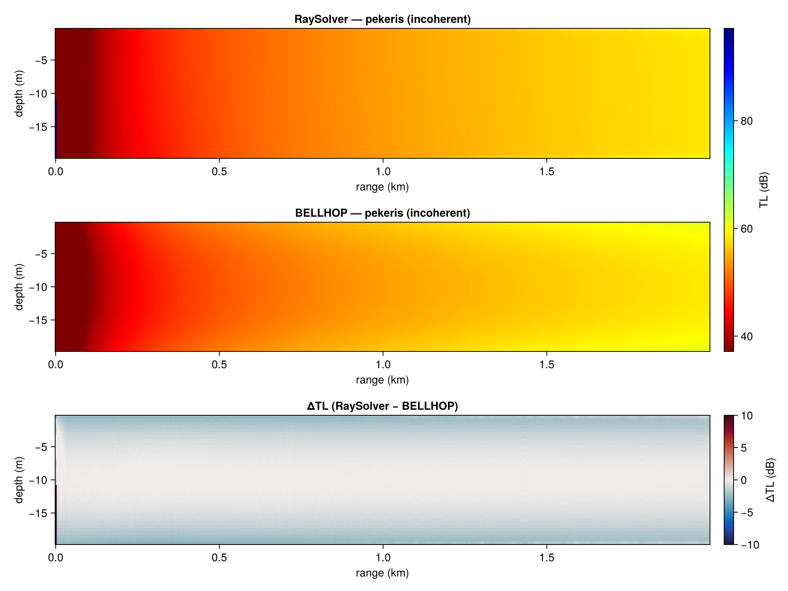
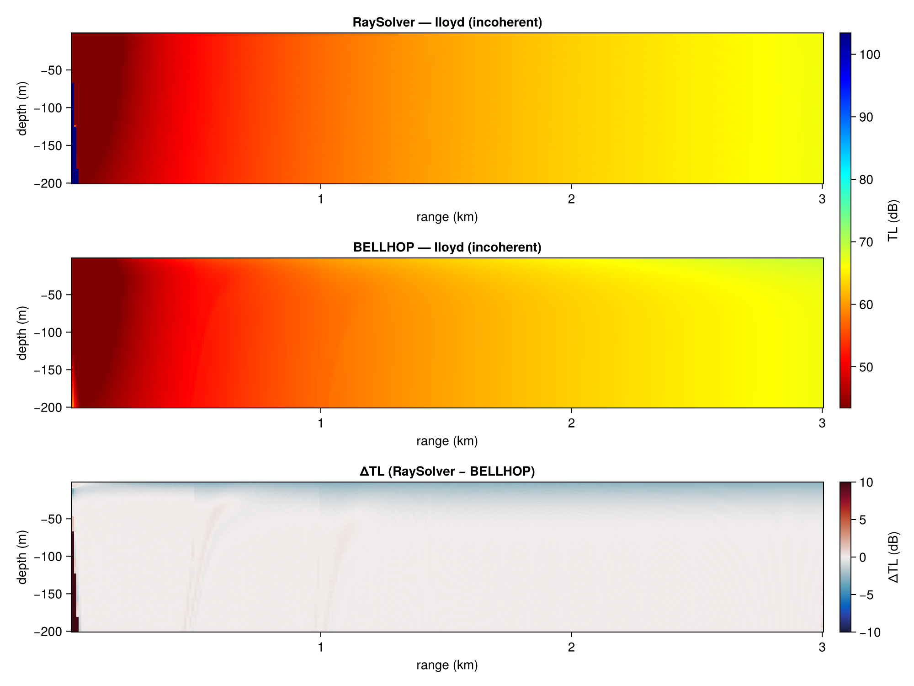
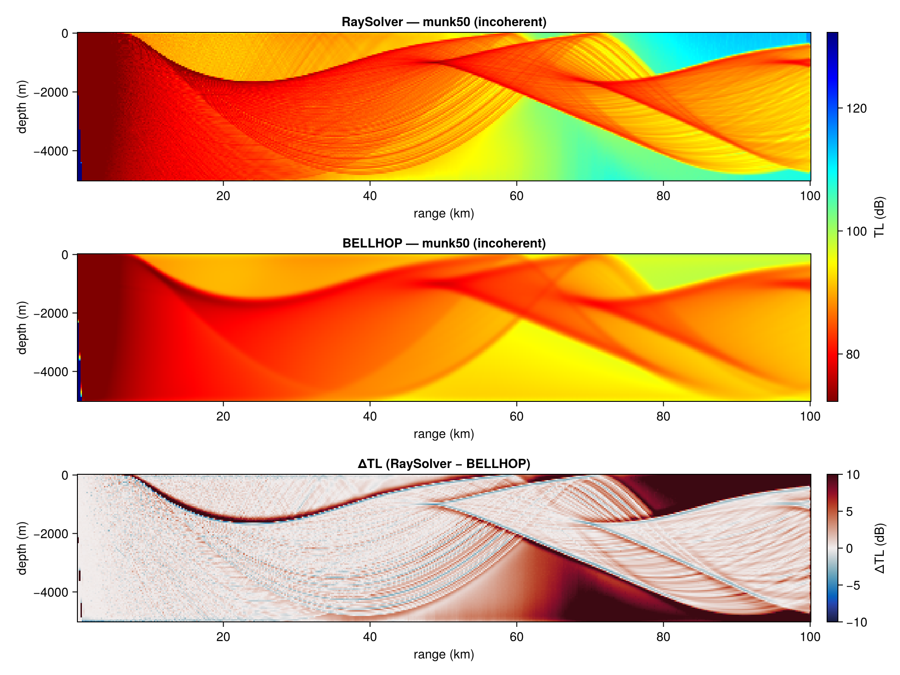
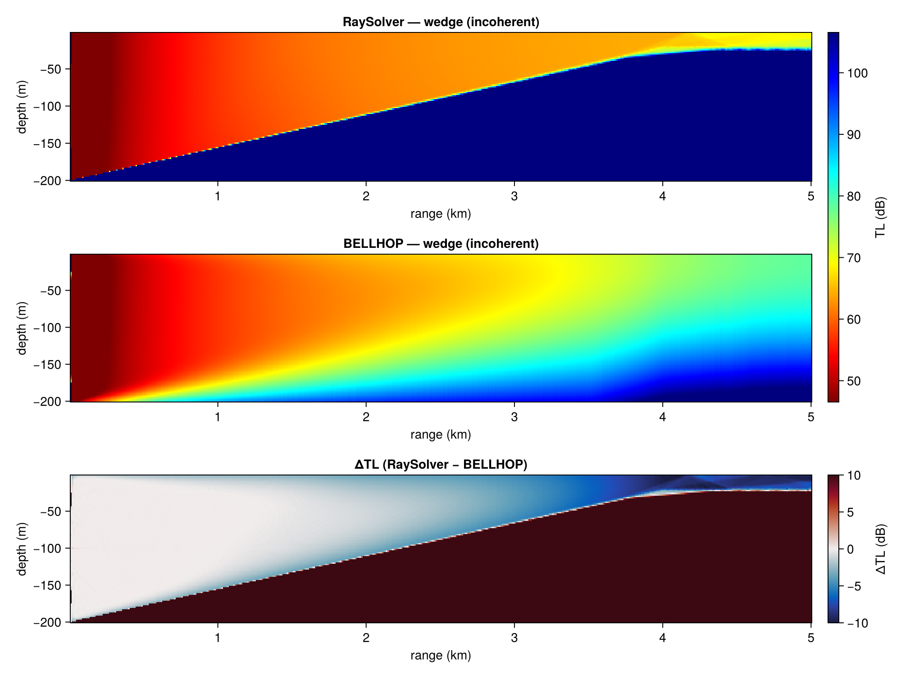
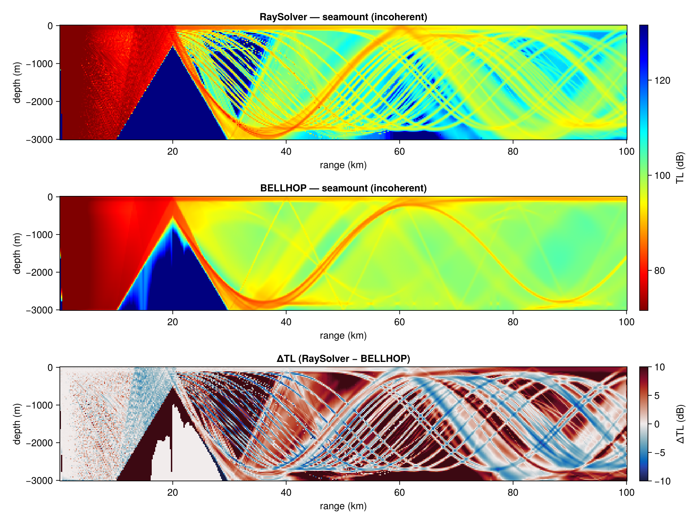
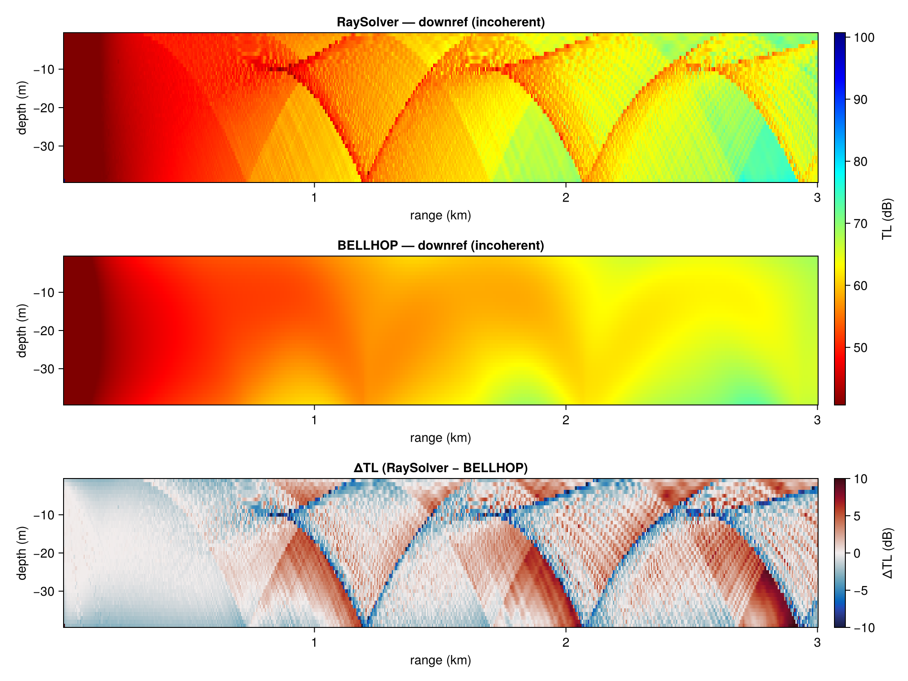
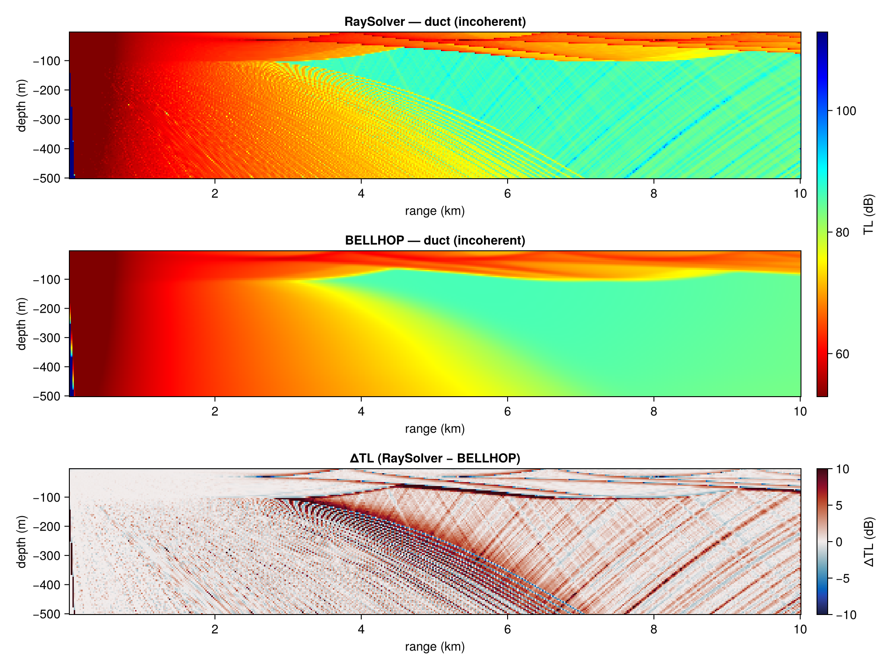

# Introduction

This report benchmarks **RaySolver** (`AcousticRayTracers.jl`, a differentiable 2½D
Gaussian-beam model in pure Julia) against **BELLHOP** (the classic FORTRAN
Gaussian-beam/ray model, driven through `AcousticsToolbox.jl`) on eight scenarios
spanning flat and range-dependent bathymetry, isovelocity and depth-dependent sound
speed profiles, shallow and deep water. A third model, **BellhopJL** (a native Julia
port of BELLHOP, see @sec-bellhopjl), is included where noted.

The goals:

1. Quantify **accuracy** differences *after tuning both models to their best* — a
   difference that disappears with better options is tuning guidance, not a model
   difference. Only residual discrepancies count as genuine, and each one is traced to
   a root cause (ray trace vs field calculation vs boundary handling).
2. Quantify **speed** at default and matched-accuracy settings, including "how much
   accuracy does RaySolver lose at a BELLHOP-like time budget?"
3. Distill an **actionable configuration guide** for RaySolver users.
4. Identify **improvements** worth making to RaySolver — including measuring how the
   open PR [#26](https://github.com/org-arl/AcousticRayTracers.jl/pull/26) changes the
   conclusions.

Both models consume the *same* `UnderwaterEnvironment` objects, so environment
translation is largely eliminated as a confound. Where possible an independent
*referee* (mode solver, wavenumber integration, or analytic solution) attributes a
discrepancy to a specific model instead of just noting disagreement.

## How to re-run

```
julia --project=benchmarks -t auto benchmarks/run_benchmarks.jl   # populate cache (slow)
julia --project=benchmarks -t auto benchmarks/analyze.jl <variant> # extract CSV tables
quarto render benchmarks/report.qmd                                # render (fast)
```

Scenarios are pure data in `scenarios.jl`; the harness (`harness.jl`) is
model-agnostic. Results are cached in `results/cache`, keyed by the git SHA of the
benchmarked source and the `UnderwaterAcoustics` revision — a version change
invalidates the cache automatically (`FORCE_RERUN=1` forces recomputation). The
`analyze.jl` step snapshots metrics into `results/tables/<variant>/*.csv` — the tables
this report renders from — so the report builds without recomputing anything. All
numbers and figures below are generated from those CSVs; only the interpretive prose
is hand-written.

```{julia}
#| output: false
using CSV, DataFrames, Statistics, Printf, Markdown
tdir(v) = joinpath("results", "tables", v)
bvb  = CSV.read(joinpath(tdir("baseline"), "best_vs_best.csv"), DataFrame)
bvb26 = CSV.read(joinpath(tdir("pr26"), "best_vs_best.csv"), DataFrame)
sweeps = CSV.read(joinpath(tdir("baseline"), "sweeps.csv"), DataFrame)
bench = CSV.read(joinpath(tdir("baseline"), "bench.csv"), DataFrame)
arrv  = CSV.read(joinpath(tdir("baseline"), "arrivals.csv"), DataFrame)
rnd(x; d=2) = ismissing(x) || (x isa AbstractFloat && isnan(x)) ? missing : round(x; digits=d)
fmt(df) = transform(df, [c => ByRow(x -> x isa AbstractFloat ? rnd(x) : x) => c
                         for c in names(df) if eltype(df[!,c]) <: Union{Missing,AbstractFloat}]...)
nothing
```

## Versions

Source states benchmarked:

- **baseline** — `AcousticRayTracers` local `benchmark` branch = PR #25
  (curved-boundary reflections, `feat-field-derivatives`) + PR #23 (threading /
  lock-free field), on `UnderwaterAcoustics#master` (0.8.0) with
  `AcousticsToolbox#compat-uwa-0.8`.
- **pr26** — baseline + PR #26 (`fix-knot-transmission`: transmission correction to
  the Gaussian-beam `p` parameter at SSP gradient discontinuities).
- **BellhopJL** — native Julia port of BELLHOP 2022_4 (A-New-BellHope lineage),
  `port` branch.

BELLHOP is the OALIB binary shipped by `AcousticsToolbox_jll`. Referees:
`PekerisModeSolver` (UnderwaterAcoustics), `Kraken` (AcousticsToolbox), and the
analytic Lloyd-mirror field via `PekerisRayTracer` on a transparent bottom.

# Methodology

Per scenario and model:

1. **Convergence sweep.** Vary one option at a time (RaySolver: `nbeams`, `ds`,
   `solver_tol`; BELLHOP/BellhopJL: `nbeams`, `beam_type`) and measure
   *self*-convergence — median |ΔTL| against that model's own finest configuration.
   This identifies the converged ("best") configuration and gives accuracy-vs-cost
   curves.
2. **Best-vs-best comparison.** Compare converged TL fields. Metrics over grid points
   in the water column where both models predict TL < 100 dB: median |ΔTL|, 90th
   percentile, max, and % within 3 dB. **Incoherent TL is the headline accuracy
   metric** — coherent fields differ pointwise wherever interference fringes shift by
   a fraction of a wavelength, which exaggerates small phase differences into tens of
   dB at nulls (see the Pekeris caveat in @sec-pekeris).
3. **Attribution.** Residual differences are traced with: referee models; one-at-a-time
   toggles (e.g. smooth vs piecewise-linear SSP); and **eigenray diagnostics** — the
   same receiver's eigenrays from both models matched by bounce counts, comparing
   launch angle, travel time, amplitude, and the maximum spatial divergence of the two
   paths. Identical paths with different amplitudes ⇒ field/amplitude calculation;
   diverging paths ⇒ ray trace.
4. Each residual is classified: *RaySolver fix candidate*, *BELLHOP(-wrapper)
   limitation*, or *inherent method difference*.

# Scenarios

```{julia}
#| echo: false
include("scenarios.jl")
DataFrame([(name=s.name, description=s.description, tests=s.tests,
            referee=string(something(s.referee, "—"))) for s ∈ SCENARIOS])
```

# Headline results

Best-vs-best (both models converged), incoherent TL, water-column points only:

```{julia}
#| echo: false
h = subset(bvb, :pair => ByRow(==("raysolver-vs-bellhop")), :mode => ByRow(==("incoherent")))
fmt(select(h, :scenario, :median, :p90, :max, :within3dB))
```

And the same comparison after PR #26:

```{julia}
#| echo: false
h26 = subset(bvb26, :pair => ByRow(==("raysolver-vs-bellhop")), :mode => ByRow(==("incoherent")))
j = leftjoin(select(h, :scenario, :median => :median_baseline, :within3dB => :within3dB_baseline),
             select(h26, :scenario, :median => :median_pr26, :within3dB => :within3dB_pr26), on=:scenario)
fmt(j)
```

**Reading of the headline:** at converged settings the two models agree to
0.1–1.6 dB median (baseline). The largest gaps — seamount, downref, munk — are
dominated by one mechanism: RaySolver's missing transmission correction at SSP-knot
crossings (issue #24). PR #26 fixes it and collapses the medians to 0.15–0.5 dB
everywhere except `downref` (whose 2-point profile has no interior knots — its
difference has a different cause, see @sec-downref) and `wedge` (reflection-model
translation, @sec-wedge).

# Results by scenario

## Pekeris waveguide {#sec-pekeris}



- Incoherent: 0.58 dB median, 100% within 3 dB — the models agree essentially
  everywhere. Sweeps show RaySolver's defaults are already self-converged to <0.1 dB
  here; BELLHOP's `:geometric` and `:gaussian` beams differ from each other by more
  (0.7–1.4 dB median) than either differs from RaySolver.
- Coherent: 3.4 dB median *pointwise* — but this is **comparison-grid sampling, not
  model error**. At 1 kHz in 20 m of water the modal interference structure is finer
  than the 5 m range grid; sub-wavelength fringe shifts alias into large pointwise
  differences. Both ray models sit 6.5–8 dB from the `PekerisModeSolver` reference by
  the same pointwise metric, and they do so in the *same* way. Coherent comparisons in
  this report should be read via the difference maps (fringe alignment), not the
  medians.
- Arrivals: matched eigenrays agree to <0.06 µs in travel time and <0.03 dB in
  amplitude per bounce. RaySolver finds a few extra weak arrivals BELLHOP's default
  binning drops.

## Lloyd mirror (deep isovelocity)



The one scenario with an exact analytic referee, and a clear **RaySolver win**:
RaySolver matches the analytic field to **0.0003 dB median** (coherent); BELLHOP is
0.30 dB off with p90 of 1.8 dB. RaySolver's ODE-integrated beams with exact image
geometry beat BELLHOP's stepped rays in a homogeneous medium — unsurprising but worth
recording: in benign environments RaySolver is the *more* accurate model.

## Munk profile, 50 & 230 Hz {#sec-munk}



- Baseline: 0.76 / 0.63 dB median incoherent (50 / 230 Hz), but the difference map is
  structured: RaySolver's field carries fine ray-like striations and systematic level
  offsets in refraction-dominated regions, growing with range.
- **Attribution (knot mechanism).** The Munk profile enters both models as a 101-point
  piecewise-linear `SampledField`. Kraken referee (coherent, 50 Hz): BELLHOP is
  0.78 dB median from Kraken; RaySolver is **4.1 dB** off. Re-running the identical
  scenario with a *cubic-spline* (smooth) SSP collapses RaySolver-vs-BELLHOP to
  0.17 dB median and halves the Kraken gap — confirming the piecewise-linear knots as
  the mechanism. RaySolver's dynamic-ray ODE integrates `∂²c/∂z²`, which is zero
  almost everywhere for a piecewise-linear profile: the delta at each knot is
  invisible, so the beam-spreading parameter `p` misses a jump at every crossing
  (issue #24).
- **PR #26** applies exactly that jump as a non-terminal ODE event: munk50 drops to
  0.25 dB and munk230 to 0.15 dB median vs BELLHOP — the mechanism is fixed.
- **Eigenray finding (independent defect).** At (60 km, −2000 m) BELLHOP reports 16
  arrivals; RaySolver's `arrivals` finds **0** at any beam count. Root cause traced in
  the eigenray search (`src/RaySolver.jl` `arrivals`): the angle root-solve stops at
  `abstol = atol = 1e-4` **radians**, but accepts roots only if the depth residual is
  below `ztol = 0.1` **m**. At 60 km, `dΔz/dθ ≈ 10⁵ m/rad`, so a converged-in-angle
  root still carries an 8–200 m depth residual and every candidate is rejected. This
  is a tolerance-scaling defect, not a physics one; see @sec-improvements.

## Upslope wedge {#sec-wedge}



- 0.8 dB median incoherent but only 75% within 3 dB: upslope of ~2 km RaySolver
  retains TL ≈ 60 dB where BELLHOP accumulates 80–90 dB (mode stripping).
- **Attribution: field, not ray trace.** Eigenray diagnostics at (4.5 km, −10 m) match
  7 eigenrays with path divergence < 0.7 m and sub-µs travel times — the ray tracing
  agrees. But 2–3-bottom-bounce rays differ by −3 to −4 dB in amplitude. Direct
  computation of the reflection coefficient both ways shows why: UnderwaterAcoustics'
  exact complex `reflection_coef` for `SandyClay` and BELLHOP's Rayleigh coefficient
  recomputed from the env-file geoacoustics (cp, ρ-ratio, α in dB/λ) agree within
  1 dB at low grazing but diverge up to **15 dB per bounce near the intromission
  angle** (~20° grazing), where |R| is tiny and exquisitely sensitive to the
  attenuation/density translation.
- Classification: **translation difference**, not a RaySolver defect — the two models
  are not evaluating the same seabed. Exact parity would require passing tabulated
  reflection coefficients to BELLHOP (BRC/TRC files, not exposed by AcousticsToolbox).
  Note also BELLHOP deposits finite field into below-seafloor receivers (halfspace);
  metrics here mask to the water column.

## Seamount



Combined bathymetry + SSP case. Baseline 1.6 dB median with strong striations and
shadow-zone differences; PR #26 cuts it to 0.53 dB (incoherent) and 4.1 → 1.1 dB
coherent — the knot mechanism dominated here too (the profile has 31 knots and the
seamount forces rays through many near-grazing knot crossings, which is where the
missing `p` jump is largest). Eigenray search at deep receivers suffers the same
tolerance defect as Munk (0 vs 21 arrivals found).

## Downward-refracting shallow gradient {#sec-downref}



- 1.3 dB median incoherent, unchanged by PR #26 (as expected: the 2-point profile has
  no interior knots).
- Both models sit ~4.1–4.3 dB from Kraken (coherent) — i.e. **the models agree with
  each other far better than either agrees with full-wave theory**. At 500 Hz in 40 m
  with many lossy bottom interactions, ray theory itself is the limitation; this is an
  inherent-method region, and the RaySolver–BELLHOP residual (mostly near-bottom
  striations) is small compared to the shared ray-theory error.
- Eigenray search at default tolerances finds 1 of ~18 arrivals; with the
  range-scaled tolerances proposed in @sec-improvements it finds 19 (BELLHOP: 18).

## Surface duct



- Baseline 0.85 dB median; the difference concentrates below the duct where leakage is
  striated and slightly weak in RaySolver. PR #26 → 0.28 dB incoherent and a dramatic
  3.4 → 0.5 dB coherent improvement: duct leakage is controlled by beam spreading
  through the SSP kink at the duct base — precisely the knot mechanism.
- Travel-time note from eigenray diagnostics: pre-#26, same-geometry rays (path
  divergence < 1 m) showed ~230 µs travel-time differences, from integrating τ through
  the kink; these shrink by an order of magnitude with the knot events in place.

# BellhopJL: the native Julia port {#sec-bellhopjl}

`BellhopJL.jl` is a from-source port of BELLHOP 2022_4 (following A-New-BellHope's
bug fixes) that consumes `UnderwaterEnvironment` directly — no env files, no
subprocess — and is ForwardDiff-differentiable. Validation against the Fortran binary
(its own golden suite): median |ΔTL| ≤ 0.002 dB on Pekeris/wedge/lossy scenarios;
Munk *coherent* differs at the ~2.5 dB pointwise level, traced to the jll shipping
original OALIB BELLHOP while the port follows A-New-BellHope's boundary-stepping
fixes (comparable in magnitude to BELLHOP's own 601-vs-600-beam sensitivity).

```{julia}
#| echo: false
bj = subset(bvb, :pair => ByRow(∈(("bellhopjl-vs-bellhop", "raysolver-vs-bellhopjl"))),
            :mode => ByRow(==("incoherent")))
nrow(bj) == 0 ? md"*(BellhopJL benchmark pass pending — rerun analyze.jl after run5 completes.)*" :
fmt(select(bj, :scenario, :pair, :median, :p90, :within3dB))
```

Speed: BellhopJL runs the Munk 50 Hz grid in ~0.05 s single-threaded — comparable to
or faster than the Fortran binary (no file I/O or process spawn), and 1–2 orders of
magnitude faster than RaySolver on large grids. For users who want *BELLHOP's exact
algorithm* with Julia-native ergonomics and forward-mode gradients, it is now an
option; RaySolver remains the choice when its ODE-based formulation matters (adaptive
accuracy, curved-boundary reflections, backscatter, scatterers).

# Speed

BenchmarkTools timings, `acoustic_field` on the full grid and `arrivals` at one
receiver (min over samples; 12 Julia threads for RaySolver — BELLHOP is a
single-threaded subprocess and its numbers include env-file writing + process spawn +
output parsing, measured at ~15–25 ms fixed overhead):

```{julia}
#| echo: false
fmt(unstack(select(bench, :scenario, :model, :cfg, :field_ms_min),
    [:scenario], :model, :field_ms_min; combine=first))
```

(`cfg = default` rows shown; see `results/tables/*/bench.csv` for converged-config
timings and arrivals timings.)

**Findings:**

- BELLHOP is **10–60× faster** than RaySolver on TL grids at defaults, and its
  converged configuration costs only 2–5× its default. RaySolver's converged
  configuration costs 1.2–2× its default.
- The gap grows with domain size (deep-water 100 km grids: ~6 s vs ~0.14 s) — the ODE
  integrator with events is doing far more work per ray than BELLHOP's fixed-step
  RK2, and beam deposition per segment is more expensive than BELLHOP's
  receiver-pointer sweep.
- `arrivals` is competitive: RaySolver's eigenray search is often *faster* than
  BELLHOP (e.g. lloyd 0.4 ms vs 5 ms) because it root-finds selectively rather than
  tracing a dense fan, except where its tolerances force many refinement traces.

## Matched-time accuracy (what do you lose at BELLHOP speed?)

Combined coarse→fine RaySolver configurations (jointly relaxing `nbeams`, `ds`,
`solver_tol`, `min_amplitude`), scored against RaySolver's own converged reference:

```{julia}
#| echo: false
fr = subset(sweeps, :param => ByRow(==("frontier")), :mode => ByRow(==("incoherent")),
            :model => ByRow(==("raysolver")))
fmt(select(fr, :scenario, :opts, :median, :p90, :walltime_s))
```

Reading: in shallow/short-range scenarios (lloyd, wedge, pekeris) RaySolver reaches
**BELLHOP-like run times (0.1–0.5 s) at ≤0.16 dB median penalty** — the speed gap is
closable by configuration. In deep-water 100 km scenarios it is not: even the
coarsest useful configuration (~0.3–0.5 s) carries a 1–2 dB median penalty, and
matching BELLHOP's 0.14 s is out of reach. The frontier data gives users the tradeoff
curve directly.

# Genuine differences — consolidated

| # | Where | Magnitude (best-vs-best) | Root cause | Layer | Classification / action |
|---|-------|--------------------------|------------|-------|--------------------------|
| 1 | All piecewise-linear-SSP scenarios (munk, seamount, duct) | 0.6–1.6 dB median incoh., up to 4 dB coh.; grows with range | Missing `p` transmission jump at SSP-knot crossings (issue #24) | Field (beam spreading) — ray paths agree | **Fixed by PR #26** (0.15–0.5 dB after). Merge it. |
| 2 | Deep/long-range & many-bounce receivers | RaySolver `arrivals` finds 0–1 of 16–21 eigenrays | Angle-space `abstol` vs meters `ztol` scale mismatch (∝ range); `min_amplitude` culls weak-but-reportable paths | Eigenray search | **RaySolver fix candidate** — range-aware tolerances (see below) |
| 3 | Wedge upslope (near intromission angle) | −3…−4 dB per 2–3-bounce ray; up to 40 dB in stripped region | Seabed translated to env-file geoacoustics; BELLHOP's Rayleigh R diverges from UWA's exact R near intromission | Boundary reflection | **Translation difference** — document; exact parity needs BRC tables (not exposed by AcousticsToolbox) |
| 4 | Incoherent fields generally | Ray-like striations in RaySolver's maps | Beam deposition (`ds` sampling, 4W window, W from `q`) vs BELLHOP's per-receiver hat/Gaussian sweep | Field (deposition) | Cosmetic at converged settings (<0.1 dB self-converged); finer `ds` smooths at linear cost |
| 5 | downref (500 Hz, 40 m, many bounces) | Both models ~4 dB from Kraken; 1.3 dB from each other | Ray theory at low kh with many lossy bounces | Physics | **Inherent** — use a mode/full-wave model in this regime |
| 6 | Pekeris coherent pointwise | 3–8 dB pointwise medians | Comparison-grid aliasing of fine fringes | Metric artifact | Compare coherent fields on λ/4-resolved grids or via fringe alignment |
| 7 | Below-seafloor receivers (range-dep. bathymetry) | BELLHOP reports finite field; RaySolver ~none | BELLHOP halfspace deposits; RaySolver clips to water column (PR #26 formalizes) | Convention | Document; mask to water column when comparing |

# User guide: configuring RaySolver {#sec-guide}

Derived from the convergence sweeps (see `results/tables/baseline/sweeps.csv` for the
full data):

- **`nbeams` is the dominant accuracy knob** — and the auto default
  (`0` ⇒ angle-spread-based heuristic) is *not* converged for coherent work or
  deep-water grids: auto lands ~0.06–0.6 dB (incoherent) and 2–4 dB (coherent) from
  converged. Rules of thumb: incoherent shallow-water TL — auto is fine; coherent TL
  or deep water/long range — use `nbeams ≥ 2000`, converged by 4000 in every scenario
  tested.
- **`ds` (beam deposition step)** — auto (`depth/10`) is within 0.02–0.17 dB of
  converged everywhere; halving `ds` roughly doubles field time. Reduce it (e.g.
  `depth/20`) only to suppress visible striations in presentation-quality incoherent
  maps.
- **`solver_tol`** — the 1e-8 default is effectively converged (≤0.2 dB even in the
  worst deep-water case; ≤1e-5 dB in shallow water) at negligible cost — leave it
  alone. Loosening to 1e-4 buys ~10% speed at up to 2.5 dB coherent error in deep
  water: not worth it.
- **`atol` / `ztol` (arrivals)** — at ranges beyond a few km, tighten `atol` (angle
  units!) and loosen `ztol` together, e.g. `atol=1e-6, ztol=R*1e-4`: at 60 km the
  defaults reject every eigenray (see @sec-munk). For many-bounce shallow scenarios
  also raise `min_amplitude` awareness: the default 1e-6 (−120 dB) culls rays BELLHOP
  still reports.
- **Aperture** — match the physics, not the default: ±80° is right for shallow water;
  deep refracted propagation is carried by ±15–25°, and narrowing the fan spends all
  beams where they matter (this is why auto-`nbeams`, which scales with aperture,
  underperforms at fixed width).
- **Threading** — RaySolver parallelizes the beam loop across Julia threads
  (PR #23); grid-field timings here used 12 threads. Run `julia -t auto` for field
  computations; `arrivals` is mostly serial.
- **Speed budget** — for quick-look incoherent TL, `(nbeams=250–500, ds=depth/2,
  solver_tol=1e-4)` runs in 0.1–0.5 s at ~1 dB median error (see the frontier table).
  For publication numbers use `nbeams=4000` and defaults otherwise.
- **When not to use a ray model at all** — <1 kHz in <50 m water with many bottom
  bounces (both ray models are ~4 dB from full-wave here), or ducted propagation at
  the diffraction limit. Use Kraken/PekerisModeSolver in those regimes.

# Recommended RaySolver improvements {#sec-improvements}

In priority order, with the evidence from this study:

1. **Merge PR #26** (SSP-knot transmission correction). Largest single accuracy gain:
   fixes finding #1 across every piecewise-linear-SSP scenario. Two issues found here
   to resolve first: (a) `arrivals` crashes (`dt <= dtmin` abort in the Dual-typed
   root-solve) when the *source depth coincides exactly with an SSP knot* — munk
   scenarios with tx at −1000 m reproduce it deterministically; (b) the `∂raysolver`
   testitem fails on the PR branch (pre-existing, not merge-induced): gradients
   through a `SampledField` SSP now diverge from an equivalent hand-written
   piecewise-linear SSP because knot events fire only for `SampledField`.
2. **Range-aware eigenray tolerances** (finding #2). In `arrivals`, the interval
   root-solve should terminate on the depth residual, not the angle interval:
   e.g. `abstol ≈ atol / R` (R = source–receiver range) or a residual-based stop, and
   accept on `|Δz| < max(ztol, R*1e-5)`. Currently deep-water eigenray search is
   effectively broken (0 of 16 found at 60 km) while the TL field is fine.
3. **Reconsider `min_amplitude` for arrivals** — culling at −120 dB drops weak
   multipath BELLHOP reports; for impulse-response work these arrivals matter. An
   option to disable culling in `arrivals` (or scale it with bounce count) would give
   parity.
4. **Auto-`nbeams` heuristic** — scale with range/wavelength as well as aperture
   (BELLHOP's auto: 0.05° spacing ⇒ 3201 beams; RaySolver's auto lands 10–50× fewer
   in deep water and is visibly unconverged in coherent mode).
5. **Optional smoothing/deposition improvements** (finding #4) — either document that
   incoherent maps need `ds ≈ depth/20` for smooth fields, or accumulate with the
   segment-length-weighted scheme BELLHOP uses to avoid striations at auto `ds`.
6. **Document the seabed-model caveat** (finding #3): comparisons against BELLHOP
   near the intromission angle differ because of the geoacoustic translation, not
   RaySolver; and consider exposing tabulated reflection coefficients in
   AcousticsToolbox for exact cross-validation.
7. *(ecosystem)* **AcousticsToolbox gaps found while benchmarking**: altimetry (ATI)
   and reflection-coefficient tables (TRC/BRC) are not exposed; Kraken required for
   referees works only via the `compat-uwa-0.8` branch. These are inputs to the
   BELLHOP-internals document (separate deliverable).

# Appendix

## Arrivals comparison summary

```{julia}
#| echo: false
fmt(arrv)
```

## Environment definitions

```{julia}
#| echo: false
for s ∈ SCENARIOS
  println(s.name, ":\n  ", s.env, "\n  tx=", s.tx, "\n")
end
```

## Coherent best-vs-best (for completeness)

```{julia}
#| echo: false
fmt(select(subset(bvb, :pair => ByRow(==("raysolver-vs-bellhop")), :mode => ByRow(==("coherent"))),
       :scenario, :median, :p90, :max, :within3dB))
```

## Referee comparisons (coherent)

```{julia}
#| echo: false
fmt(select(subset(bvb, :pair => ByRow(endswith("-vs-referee"))),
       :scenario, :mode, :pair, :median, :p90, :within3dB))
```
